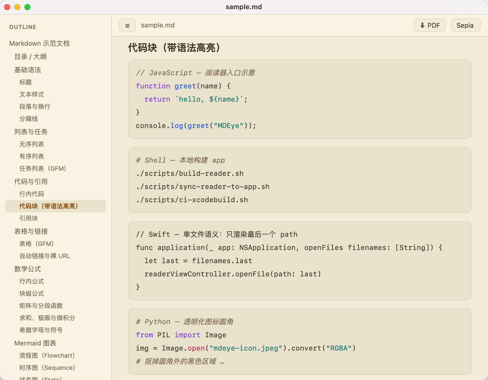
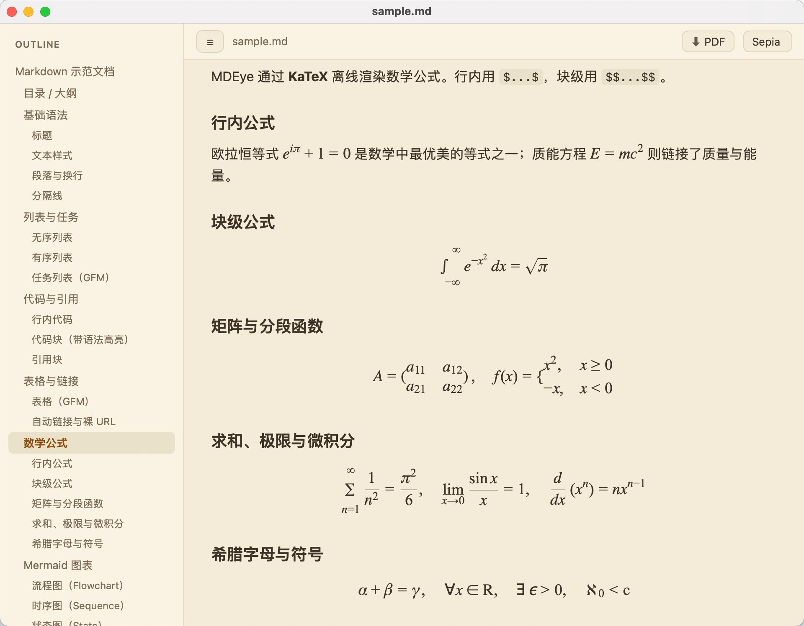
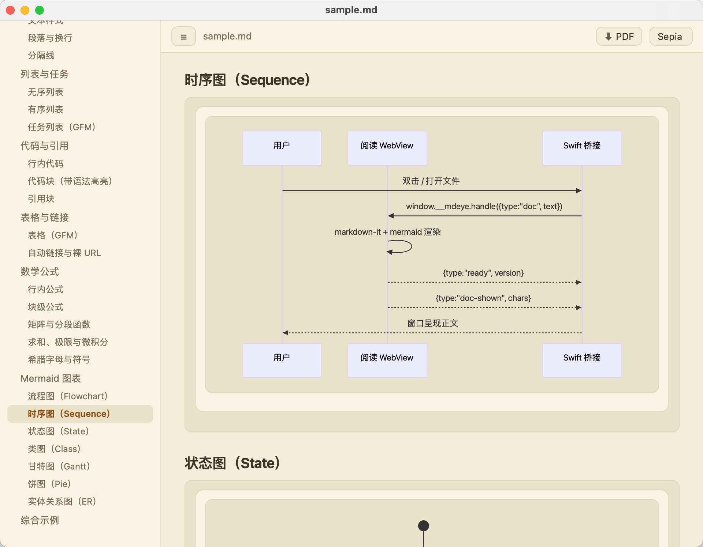
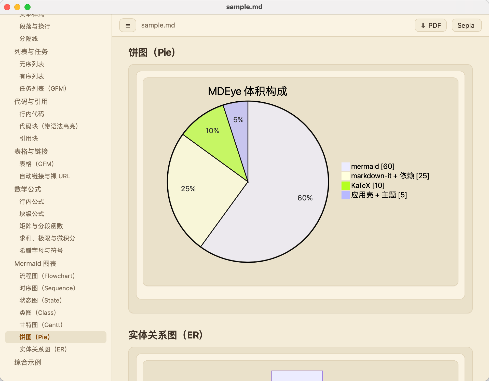

# MDEye

[中文](#中文) | [English](#english)

---

## 中文

本地优先的 **macOS Markdown 阅读器**（不是编辑器 / 笔记库）。

> 小体积 · 快启动 · 不登录 · 不联网 · 不打扰 · 专注阅读

灵感来自 [MDView](https://www.mdview.cn/)。

**当前版本：v0.7.1** · [Releases](https://github.com/ijaa/mdeye/releases)

### 界面预览

<table>
  <tr><td align="center"></td><td align="center"></td></tr>
  <tr><td align="center"></td><td align="center"></td></tr>
</table>

以上为 MDEye 在 macOS 上的真实渲染界面，覆盖 GFM 表格 / 代码高亮 / Mermaid 图表 / 数学公式等场景。

### 功能

- 打开 / 拖放 / **双击** `.md`（可设为默认应用）
- GFM：表格、任务列表、自动链接等
- **Mermaid** 图表（完整打包、离线）
- **KaTeX** 数学公式（$inline$ 与 $$display$$，离线）
- 磁盘文件变更后自动刷新
- 大纲（H1–H3）
- 主题：Light / Dark / Sepia / Green（默认 Sepia）
- **字号缩放**（⌘+/⌘-/⌘0，85%–200%）
- **栏宽调整**（⌥+/⌥-，600–1100px）
- **文内查找**（⌘F/⌘G/⇧⌘G）
- **冷启动恢复**上次打开的文件
- **GB18030** 中文编码支持
- 本地相对路径图片（限制在 md 所在目录树）
- 从工具栏或 MDEye 菜单导出 PDF
- **Open in Editor** 快速跳转 TextEdit 编辑
- 全离线、无遥测
- **Universal Binary**（Apple Silicon `arm64` + Intel `x86_64`）
- 自定义圆角图标（透明角，无黑边）

### 安装（自用 · 未签名）

1. 从 [Releases](https://github.com/ijaa/mdeye/releases) 下载 `mdeye-x.y.z.dmg`
2. 将 `mdeye.app` 拖到 **应用程序**
3. 首次打开：若被拦截 → **系统设置 → 隐私与安全性 → 仍要打开**
4. 设为默认 Markdown 应用（任选其一）：

**A. 应用内（推荐）** —— 菜单 **MDEye → Set as Default Markdown App…**

**B. Finder（最稳妥）** —— 选中任意 `.md` → **显示简介**（`⌘I`）→ **打开方式 → MDEye → 全部更改…**

### 环境要求

| 用途 | 要求 |
|------|------|
| 运行 | macOS 12+ |
| 开发 reader UI | Node.js 18+ |
| 编译 `.app` | Xcode（本仓库默认用 GitHub Actions `macos-14`；笔记本可不装 Xcode） |

### PDF 导出

PDF 导出使用独立打印 WebView，复用应用内相同的 Markdown 渲染管线，包括代码高亮、本地图片和 Mermaid。字体、图片、图表与布局稳定后，再由 WebKit 原生打印管线按 A4、16 mm 边距分页。打印专用 CSS 会移除阅读控件并使用适合纸张的浅色主题，因此正文内容和排版与应用保持一致，但导航界面与屏幕主题颜色会被有意排除。

导出过程不会修改正在阅读的 WebView。CI 会用长文档走生产导出协调器，验证真实多页 PDF，并把 `pdf-selftest.pdf` 与 `mdeye.app` 一起放入 `mdeye-app` artifact。

### 开发

**只改阅读器前端**

```bash
cd reader
npm ci
npm run build      # esbuild → 单文件 IIFE app.js
npm run preview    # 浏览器预览
npm test
```

产物同步进 App 包资源：

```bash
./scripts/build-reader.sh
./scripts/sync-reader-to-app.sh
# → App/Resources/reader/{index.html,app.js,styles/}
```

**有 Xcode 时本地打 app**

```bash
./scripts/build-reader.sh
./scripts/sync-reader-to-app.sh
./scripts/ci-xcodebuild.sh
# → build/mdeye.app（强制 arm64 + x86_64）

VERSION=0.7.1 ./scripts/package-dmg.sh
# → build/mdeye-0.7.1.dmg
```

**无 Xcode**

push 和 pull request 会执行完整 App 构建与 PDF 自检。如需不打 tag 主动构建，可进入 **Actions → CI → Run workflow**；`mac-app` job 成功后下载 `mdeye-app` artifact。发布 tag 才会产出 unsigned `.dmg`。

```bash
git tag vX.Y.Z
git push origin vX.Y.Z
```

**图标**

源图建议：圆角外 **透明** 的 PNG 最佳；JPEG 圆角外常被填黑。

```bash
# 本地有 Pillow 时，可从 JPEG 自动抠黑边为透明再生成 icns：
./scripts/build-icon.sh ~/Downloads/mdeye-icon.jpeg
# → App/AppIcon.icns 与 App/Assets/mdeye-icon-transparent.png
```

图标必须落在包内：

```text
mdeye.app/Contents/Resources/AppIcon.icns
```

（不能嵌套在 `Contents/Resources/Resources/` 下。）

换图标后若 Dock 仍显示旧图：

```bash
rm -rf ~/Library/Caches/com.apple.iconservices.store
killall Dock Finder
```

**冒烟验证（确认双击能渲染正文）**

安装 app 后：

```bash
./scripts/verify-open.sh /path/to/mdeye.app
# 成功时会写 /tmp/mdeye-last-shown.json（doc-shown 戳记）
```

### 仓库结构

```text
App/
  Sources/           # Swift：窗口、WKWebView、桥接、文件监听、默认应用、PathSandbox、SelfTest
  Resources/reader/  # 同步后的静态阅读器（index.html + IIFE app.js + css）
  AppIcon.icns       # 扁平资源 → Contents/Resources/AppIcon.icns
  Assets/            # logo 源图、透明 PNG 缓存
  Info.plist
  mdeye.xcodeproj/
reader/              # 前端源码（markdown-it + mermaid + esbuild IIFE）
scripts/             # 构建 / 同步 / 图标 / dmg / 渲染自检
fixtures/            # 样例 md
.github/workflows/   # ci.yml + release.yml
docs/
  architecture.md    # 架构详解
  screenshots/       # README 用的界面截图（不进 app 包）
README.md            # 双语（中文 + English）
```

### 关键架构（与实现对齐）

```text
Swift (AppKit)
  · main.swift 显式 NSApplication.run（另：--selftest / --pdf-selftest CI 自检模式）
  · 打开文件：open urls / openFile / openFiles（单文件：仅渲染最后一个 path）
  · mdeye-app:// 加载 UI（AppSchemeHandler）
  · mdeye-asset:// 提供本地图片（AssetSchemeHandler）
  · PathSandbox：两 handler 共用的相对路径拼接 + `..` 防护
  · WKScriptMessageHandler 桥接
  · PDF 导出走独立 file-backed WKWebView + A4 NSPrintOperation 打印分页
        ↕
Static reader (IIFE app.js，禁止 type=module)
  · markdown-it GFM + 大纲 + 主题
  · mermaid 静态打入同一 bundle
```

**重要实现约束（踩坑结论）：**

1. WKWebView 下 **不要用 ESM `type=module` + chunks**（`file://` / 分片加载会失败 → 正文空白）
2. 使用 **单文件 classic script（IIFE）** + **`mdeye-app://`**
3. 冷/热打开要保留 `latestDoc` 并在 JS ready / 重试后推送
4. 图标必须在 `Contents/Resources/AppIcon.icns`，且圆角外需 **透明**
5. 单文件阅读器：只渲染最后打开的 path，不做多窗口/标签
6. 导出 **只做 PDF**，走独立 file-backed WKWebView + `@media print` + A4 `NSPrintOperation`，不改动阅读 WebView

更多细节见：[docs/architecture.md](docs/architecture.md)

### 脚本一览

| 脚本 | 作用 |
|------|------|
| `scripts/build-reader.sh` | `npm ci` + 构建 reader |
| `scripts/sync-reader-to-app.sh` | `reader/dist` → `App/Resources/reader` |
| `scripts/ci-xcodebuild.sh` | Release 通用架构编译 + 体积/图标/架构门禁 |
| `scripts/package-dmg.sh` | 未签名 dmg |
| `scripts/build-icon.sh` | 生成 `AppIcon.icns` |
| `scripts/process-icon-alpha.py` | JPEG 黑角 → 透明 PNG（需本地 Pillow） |
| `scripts/verify-open.sh` | 冷/热打开渲染冒烟（本机 GUI；会装入 /Applications） |
| `scripts/ci-selftest.sh` | 无头渲染 + 多页 PDF 导出自检（CI 用） |

### 版本与发布

- 版本号：`App/Info.plist` 的 `CFBundleShortVersionString` / `CFBundleVersion`（当前 **0.7.1 / 16**）
- CI：push / pull request / 手动 `workflow_dispatch` → App 构建、结构门禁、渲染自检与生产多页 PDF 导出自检
- Release：tag `v*` → dmg + GitHub Release 说明（含「仍要打开」）

当前为 **未签名自用构建**（无需 Apple Developer 年费）。公开分发再考虑 Developer ID + 公证。

### 开源协议

Apache License 2.0（见 [LICENSE](LICENSE)）

---

## English

Local-first **Markdown reader for macOS** (not an editor / note vault).

> Small · Fast · No account · No network · No distraction · Focus on reading

Inspired by [MDView](https://www.mdview.cn/).

**Current version: v0.7.1** · [Releases](https://github.com/ijaa/mdeye/releases)

### Screenshots

<table>
  <tr><td align="center"></td><td align="center"></td></tr>
  <tr><td align="center"></td><td align="center"></td></tr>
</table>

These are real MDEye renderings on macOS, covering GFM tables / code highlighting / Mermaid diagrams / math formulas.

### Features

- Open / drag-drop / **double-click** `.md` (can be set as default app)
- GFM: tables, task lists, autolinks, etc.
- **Mermaid** diagrams (bundled, offline)
- **KaTeX** math formulas ($inline$ and $$display$$, offline)
- Auto-refresh when the file changes on disk
- Outline (H1–H3)
- Themes: Light / Dark / Sepia / Green (Sepia by default)
- **Font size scaling** (⌘+/⌘-/⌘0, 85%–200%)
- **Content width adjustment** (⌥+/⌥-, 600–1100px)
- **In-document search** (⌘F/⌘G/⇧⌘G)
- **Cold-start restore** last opened file
- **GB18030** Chinese encoding support
- Local relative images (sandboxed to the markdown folder tree)
- Export PDF from the toolbar or the MDEye menu
- **Open in Editor** quick jump to TextEdit
- Fully offline, no telemetry
- **Universal Binary** (Apple Silicon `arm64` + Intel `x86_64`)
- Custom rounded app icon (transparent corners, no black frame)

### Install (self-use, unsigned)

1. Download `mdeye-x.y.z.dmg` from [Releases](https://github.com/ijaa/mdeye/releases)
2. Drag `mdeye.app` into **Applications**
3. First launch: if blocked → **System Settings → Privacy & Security → Open Anyway**
4. Set as default Markdown app (either):

**A. In-app (recommended)** — menu **MDEye → Set as Default Markdown App…**

**B. Finder (most reliable)** — select any `.md` → **Get Info** (`⌘I`) → **Open with → MDEye → Change All…**

### Requirements

| Use case | Requirement |
|----------|-------------|
| Run | macOS 12+ |
| Develop reader UI | Node.js 18+ |
| Build `.app` | Xcode (default: GitHub Actions `macos-14`; laptop Xcode optional) |

### PDF export

PDF export uses a dedicated print WebView that renders the same Markdown pipeline as the reader, including code highlighting, local images, and Mermaid. It waits for fonts, images, diagrams, and layout to stabilize, then uses the native WebKit print pipeline to paginate onto A4 paper with 16 mm margins. Print-specific CSS removes reading controls and uses a paper-friendly light theme, so the document content and typography remain aligned with the app while navigation chrome and screen theme colors are intentionally excluded.

The reading WebView is not modified during export. CI runs the production export coordinator against a long fixture, validates a real multi-page PDF, and includes `pdf-selftest.pdf` in the `mdeye-app` artifact.

### Development

**Reader frontend only**

```bash
cd reader
npm ci
npm run build      # esbuild → single IIFE app.js
npm run preview    # browser preview
npm test
```

Sync build output into the app bundle resources:

```bash
./scripts/build-reader.sh
./scripts/sync-reader-to-app.sh
# → App/Resources/reader/{index.html,app.js,styles/}
```

**Local app build (with Xcode)**

```bash
./scripts/build-reader.sh
./scripts/sync-reader-to-app.sh
./scripts/ci-xcodebuild.sh
# → build/mdeye.app (forces arm64 + x86_64)

VERSION=0.7.1 ./scripts/package-dmg.sh
# → build/mdeye-0.7.1.dmg
```

**Without Xcode**

Pushes and pull requests run the full app build and PDF self-test. To build without creating a tag, open **Actions → CI → Run workflow**; download the `mdeye-app` artifact after the `mac-app` job succeeds. Release tags produce the unsigned `.dmg`.

```bash
git tag vX.Y.Z
git push origin vX.Y.Z
```

**App icon**

Prefer a **PNG with transparent outside corners**. JPEG rounded exports often fill the exterior with black.

```bash
# With Pillow installed, convert JPEG black exterior → transparent, then icns:
./scripts/build-icon.sh ~/Downloads/mdeye-icon.jpeg
# → App/AppIcon.icns and App/Assets/mdeye-icon-transparent.png
```

Icon must live at:

```text
mdeye.app/Contents/Resources/AppIcon.icns
```

(Not nested under `Contents/Resources/Resources/`.)

If Dock still shows an old icon after replacing:

```bash
rm -rf ~/Library/Caches/com.apple.iconservices.store
killall Dock Finder
```

**Smoke test (double-click actually renders body)**

After installing the app:

```bash
./scripts/verify-open.sh /path/to/mdeye.app
# On success writes /tmp/mdeye-last-shown.json (doc-shown stamp)
```

### Repository layout

```text
App/
  Sources/           # Swift: window, WKWebView, bridge, file watch, default app, PathSandbox, SelfTest
  Resources/reader/  # synced static reader (index.html + IIFE app.js + css)
  AppIcon.icns       # flat resource → Contents/Resources/AppIcon.icns
  Assets/            # logo source + transparent PNG cache
  Info.plist
  mdeye.xcodeproj/
reader/              # frontend (markdown-it + mermaid + esbuild IIFE)
scripts/             # build / sync / icon / dmg / render self-tests
fixtures/            # sample markdown
.github/workflows/   # ci.yml + release.yml
docs/
  architecture.md    # architecture deep-dive
  screenshots/       # README screenshots (not packaged into the app)
README.md            # bilingual (Chinese + English)
```

### Architecture (matches implementation)

```text
Swift (AppKit)
  · main.swift explicit NSApplication.run  (also: --selftest / --pdf-selftest CI modes)
  · open urls / openFile / openFiles  (single-file: only the last path renders)
  · mdeye-app:// loads UI (AppSchemeHandler)
  · mdeye-asset:// serves local images (AssetSchemeHandler)
  · PathSandbox: shared safe relative-path join + ".." guard for both schemes
  · WKScriptMessageHandler bridge
  · PDF export via a dedicated file-backed WKWebView + A4 NSPrintOperation pagination
        ↕
Static reader (IIFE app.js — no type=module)
  · markdown-it GFM + outline + themes
  · mermaid statically bundled
```

**Hard constraints (lessons learned):**

1. Do **not** use ESM `type=module` + chunks under WKWebView (`file://` / chunk load fails → blank body)
2. Use a **single classic IIFE script** + **`mdeye-app://`**
3. Keep `latestDoc` across cold/warm open; push after JS ready / retries
4. Icon must be `Contents/Resources/AppIcon.icns` with **transparent** exterior
5. Single-file reader: render only the last-opened path; no multi-window/tabs
6. Export is **PDF only**, via a dedicated file-backed WKWebView + `@media print` + A4 `NSPrintOperation`; the reading webview is never mutated

More detail: [docs/architecture.md](docs/architecture.md)

### Scripts

| Script | Purpose |
|--------|---------|
| `scripts/build-reader.sh` | `npm ci` + build reader |
| `scripts/sync-reader-to-app.sh` | `reader/dist` → `App/Resources/reader` |
| `scripts/ci-xcodebuild.sh` | Release universal build + size/icon/arch gates |
| `scripts/package-dmg.sh` | Unsigned dmg |
| `scripts/build-icon.sh` | Generate `AppIcon.icns` |
| `scripts/process-icon-alpha.py` | JPEG black corners → transparent PNG (needs Pillow) |
| `scripts/verify-open.sh` | Cold/warm open render smoke test (local GUI; installs into /Applications) |
| `scripts/ci-selftest.sh` | Headless render + multi-page PDF export self-checks (CI) |

### Version & release

- Version: `CFBundleShortVersionString` / `CFBundleVersion` in `App/Info.plist` (currently **0.7.1 / 16**)
- CI: push / pull request / manual `workflow_dispatch` → app build, structural gates, render self-test, and production multi-page PDF export self-test
- Release: tag `v*` → dmg + GitHub Release notes (includes Open Anyway steps)

Builds are **unsigned self-use** (no Apple Developer fee). Consider Developer ID + notarization only for public distribution.

### License

Apache License 2.0 (see [LICENSE](LICENSE))
