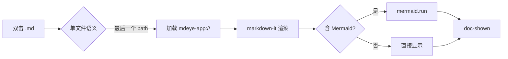
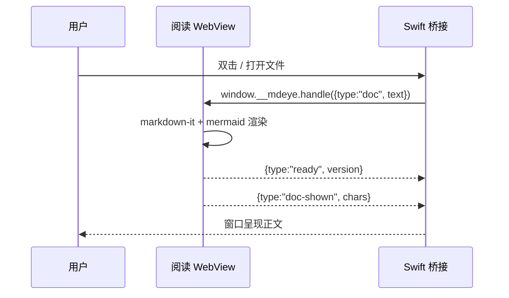
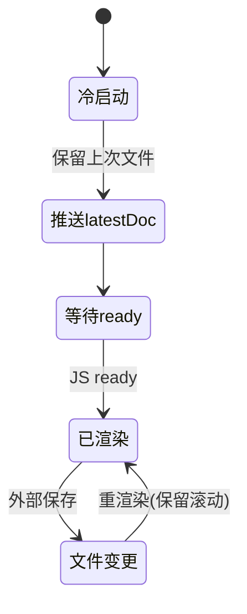
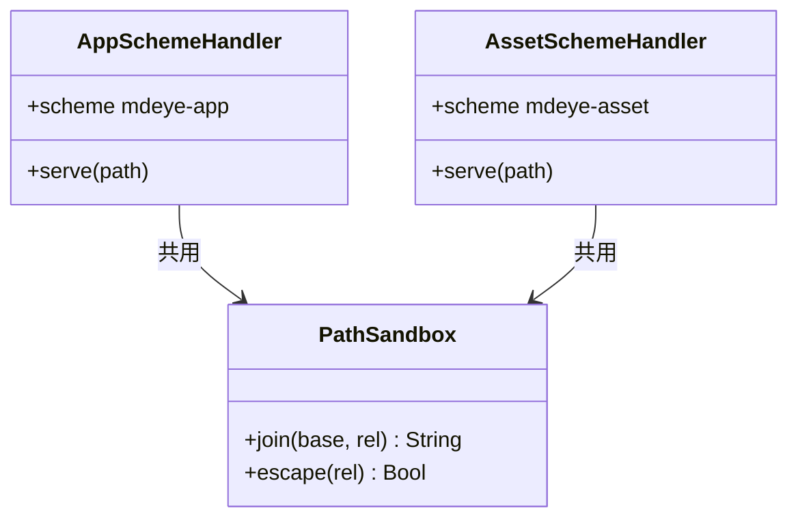
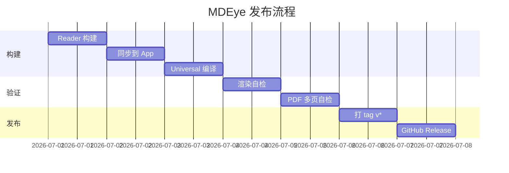
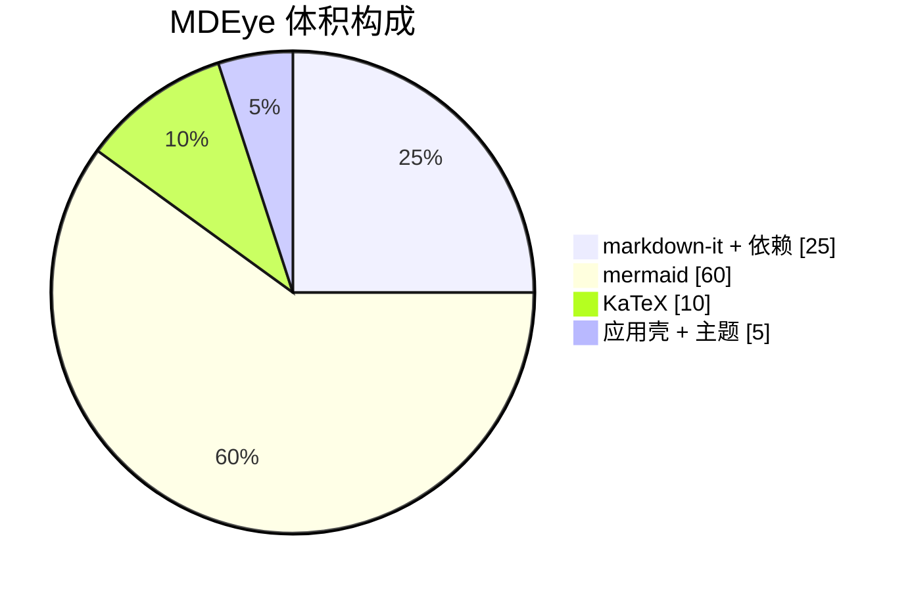
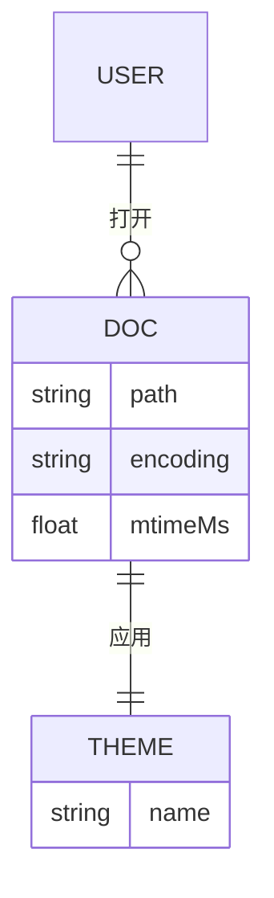
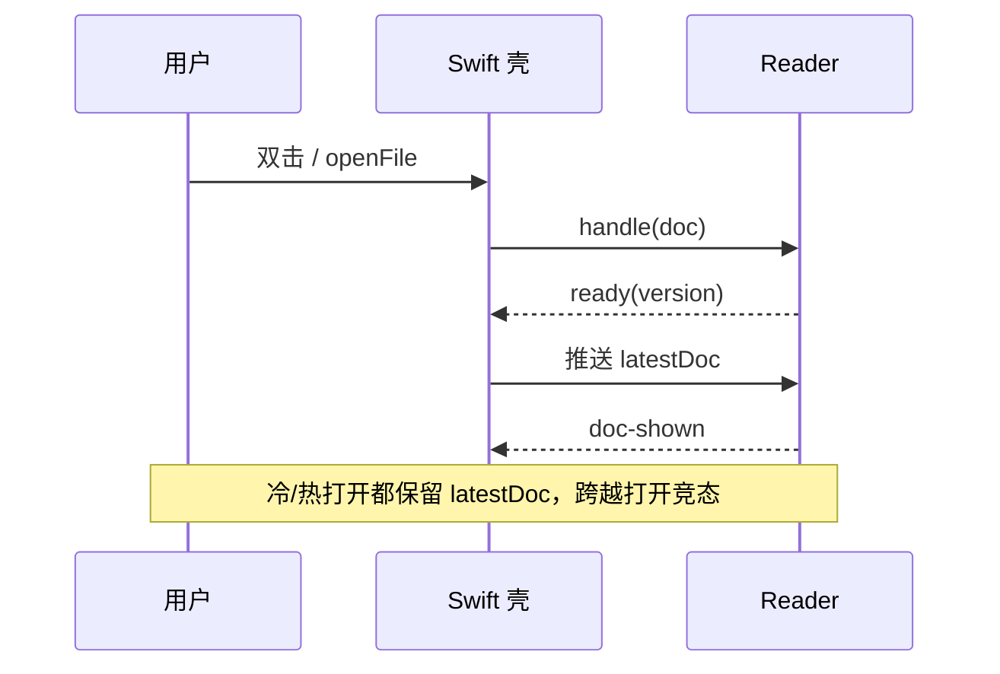

# Markdown 示范文档

这是 MDEye 的完整 Markdown 示范文档，覆盖基础语法、GFM 扩展、数学公式与 Mermaid 图表等。**上中文、对照渲染**，可用来快速验证阅读器对各类语法的支持。

> 小体积 · 快启动 · 不登录 · 不联网 · 不打扰 · 专注阅读

**当前文档**：`fixtures/sample.md` · [Releases](https://github.com/ijaa/mdeye/releases)

---

## 目录 / 大纲

MDEye 会自动解析 `H1–H3` 生成大纲（菜单 **View → Outline** 或快捷键切换）。本文档结构如下：

- 基础语法
- 列表与任务
- 代码与引用
- 表格与链接
- 数学公式
- Mermaid 图表
- 综合示例

## 基础语法

### 标题

```markdown
# 一级标题
## 二级标题
### 三级标题
#### 四级标题（不在大纲内）
```

### 文本样式

- **加粗**（`**加粗**`）
- *斜体*（`*斜体*`）
- ***粗斜体***（`***粗斜体***`）
- ~~删除线~~（`~~删除线~~`，GFM）
- `行内代码`（`` `行内代码` ``）
- 这是带^上标^的写法说明（标准 Markdown 不支持上标，此处仅作占位；MDEye 用 KaTeX 渲染上下标，见数学公式章节）

### 段落与换行

 paragraph 段落之间用空行分隔。
这是第二段。同一段内换行需在行尾加两个空格，或在下一行行首缩进——这里演示结尾两个空格的软换行 →
软换行后的同一段文字。

### 分隔线

三个或更多连字符即可生成分隔线：

---

## 列表与任务

### 无序列表

- 一级条目
  - 二级条目
    - 三级条目
- 回到一级
- 另一个一级

### 有序列表

1. 第一项
2. 第二项
   1. 嵌套第一
   2. 嵌套第二
3. 第三项

### 任务列表（GFM）

- [x] 离线阅读，不联网
- [x] Mermaid 完整打包
- [x] KaTeX 离线公式
- [ ] 你也想试用 MDEye
- [ ] 但故意留一个未完成项

## 代码与引用

### 行内代码

安装命令为 `npm ci`，构建脚本为 `./scripts/build-reader.sh`。

### 代码块（带语法高亮）

```js
// JavaScript — 阅读器入口示意
function greet(name) {
  return `hello, ${name}`;
}
console.log(greet("MDEye"));
```

```bash
# Shell — 本地构建 app
./scripts/build-reader.sh
./scripts/sync-reader-to-app.sh
./scripts/ci-xcodebuild.sh
```

```swift
// Swift — 单文件语义：只渲染最后一个 path
func application(_ app: NSApplication, openFiles filenames: [String]) {
  let last = filenames.last
  readerViewController.openFile(path: last)
}
```

```python
# Python — 透明化图标圆角
from PIL import Image
img = Image.open("mdeye-icon.jpeg").convert("RGBA")
# 抠掉圆角外的黑色区域 …
```

### 引用块

> 本地优先的 Markdown 阅读器。
>
> 不是编辑器，也不是笔记库——它只负责把 `.md` 渲染得好看。
>
> ——灵感来自 [MDView](https://www.mdview.cn/)

## 表格与链接

### 表格（GFM）

| 功能 | 状态 | 快捷键 | 备注 |
| ---- | :--: | ------ | ---- |
| 字号缩放 | ✅ | ⌘+ / ⌘- / ⌘0 | 85%–200% |
| 栏宽调整 | ✅ | ⌥+ / ⌥- | 600–1100px |
| 文内查找 | ✅ | ⌘F / ⌘G / ⇧⌘G | — |
| 大纲视图 | ✅ | View 菜单 | H1–H3 |
| 导出 PDF | ✅ | 工具栏 / 菜单 | A4 · 16mm 边距 |

### 自动链接与裸 URL

- 自动链接：<https://www.mdview.cn/>
- 带文字的链接：[MDEye Releases](https://github.com/ijaa/mdeye/releases)
- 裸 URL（GFM 自动识别）：https://github.com/ijaa/mdeye

## 数学公式

MDEye 通过 **KaTeX** 离线渲染数学公式。行内用 `$...$`，块级用 `$$...$$`。

### 行内公式

欧拉恒等式 $e^{i\pi} + 1 = 0$ 是数学中最优美的等式之一；质能方程 $E = mc^2$ 则链接了质量与能量。

### 块级公式

$$
\int_{-\infty}^{\infty} e^{-x^2}\,dx = \sqrt{\pi}
$$

### 矩阵与分段函数

$$
A = \begin{pmatrix} a_{11} & a_{12} \\ a_{21} & a_{22} \end{pmatrix}, \quad
f(x) = \begin{cases} x^2, & x \ge 0 \\ -x, & x < 0 \end{cases}
$$

### 求和、极限与微积分

$$
\sum_{n=1}^{\infty} \frac{1}{n^2} = \frac{\pi^2}{6}, \quad
\lim_{x \to 0} \frac{\sin x}{x} = 1, \quad
\frac{d}{dx}\left( x^n \right) = n x^{n-1}
$$

### 希腊字母与符号

$$
\alpha + \beta = \gamma, \quad \forall x \in \mathbb{R}, \quad \exists\, \epsilon > 0, \quad \aleph_0 < \mathfrak{c}
$$

## Mermaid 图表

所有图表均静态打进 bundle，完全离线渲染。

### 流程图（Flowchart）



### 时序图（Sequence）



### 状态图（State）



### 类图（Class）



### 甘特图（Gantt）



### 饼图（Pie）



### 实体关系图（ER）



## 综合示例

把上面几类放在一起看一段长文档的典型片段：

> **开箱即用的离线阅读体验。**
>
> 打开任意 `.md` 文件即可阅读——支持 GFM 表格、任务列表、自动链接，以及 Mermaid 图表与 KaTeX 公式的离线渲染。

下面这张时序图概括了一次打开操作的生命周期：



对应的核心计算公式与渲染开销关系可简化为：

$$
T_{\text{render}} \approx T_{\text{md}} + \big[\,T_{\text{mermaid}} \cdot \mathbb{1}_{\text{hasMermaid}}\,\big] + \big[\,T_{\text{katex}} \cdot \mathbb{1}_{\text{hasMath}}\,\big]
$$

---

**License**：Apache License 2.0（见 [LICENSE](https://github.com/ijaa/mdeye/blob/main/LICENSE)）。
